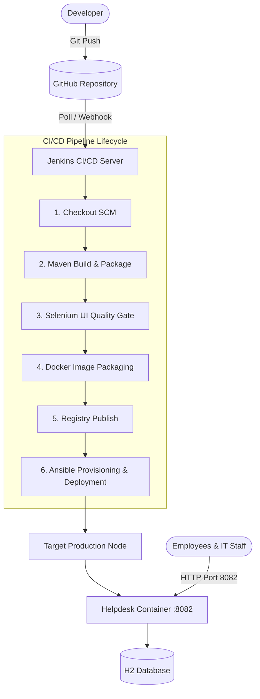

# 🛠️ Jenkins Deployment for an Employee Helpdesk System

[](https://github.com/AdiSinghCodes/Jenkins)
[](https://github.com/AdiSinghCodes/Jenkins)
[](https://github.com/AdiSinghCodes/Jenkins)
[](https://github.com/AdiSinghCodes/Jenkins)
[](https://github.com/AdiSinghCodes/Jenkins)

---

## 📌 Project Overview

**Student Name**: Aditya Singh  
**Roll Number**: `23102B0010`  
**Class/Branch**: CMPN SEM-7 DIV-B  
**Project Title**: Jenkins Deployment for an Employee Helpdesk System  
**Repository**: [https://github.com/AdiSinghCodes/Jenkins.git](https://github.com/AdiSinghCodes/Jenkins.git)

The **Employee Helpdesk System** is an enterprise IT service management web application paired with an end-to-end automated **DevOps CI/CD Lifecycle**. The system allows employees to submit IT incident tickets, track progress, and enables IT support teams to manage role-based status workflows via an interactive real-time analytics dashboard.

---

## 🏗️ Technical Architecture & DevOps Flow



---

## 🚀 Quick Start & Local Setup

### Prerequisites
- **Java 17 JDK** or higher
- **Git**

### Running the Application Locally

1. **Clone the repository**:
   ```bash
   git clone https://github.com/AdiSinghCodes/Jenkins.git
   cd Jenkins
   ```

2. **Build and Run using Maven Wrapper**:
   ```bash
   # On Windows PowerShell
   .\mvnw spring-boot:run
   
   # On Linux / macOS
   ./mvnw spring-boot:run
   ```

3. **Access the Web Dashboard**:
   Open your browser and navigate to:
   - **Dashboard**: `http://localhost:8082/dashboard`
   - **All Tickets**: `http://localhost:8082/tickets`
   - **Submit Ticket**: `http://localhost:8082/tickets/new`
   - **Actuator Health Check**: `http://localhost:8082/actuator/health`
   - **H2 Database Console**: `http://localhost:8082/h2-console` (JDBC URL: `jdbc:h2:mem:helpdeskdb`)

---

## 📁 Repository Directory Structure

```text
├── .github/
│   ├── ISSUE_TEMPLATE/
│   │   ├── bug_report.md
│   │   └── feature_request.md
│   └── PULL_REQUEST_TEMPLATE.md
├── docs/
│   ├── 01_Problem_Statement_and_Scope.md
│   ├── 02_Agile_Planning_and_DevOps_Workflow.md
│   ├── 03_SRS_Architecture_and_DataModel.md
│   ├── 04_Git_Policy_and_Branching.md
│   ├── 13_14_Ansible_Configuration_and_Provisioning.md
│   └── 15_Final_DevOps_Project_Report.md
├── devops/
│   ├── jenkins/
│   │   ├── Jenkinsfile
│   │   └── jenkins_job_config.xml
│   ├── docker/
│   │   ├── Dockerfile
│   │   ├── docker-compose.yml
│   │   └── docker_lifecycle.sh
│   └── ansible/
│       ├── inventory.ini
│       ├── playbook.yml
│       └── health_check_rollback.sh
├── src/
│   ├── main/
│   │   ├── java/com/helpdesk/
│   │   └── resources/
│   └── test/
│       └── java/com/helpdesk/
├── pom.xml
├── README.md
└── .gitignore
```

---

## 🔀 Git Branching Policy

We strictly adhere to standard Gitflow rules:
- **`main`**: Production release-ready code (tagged e.g., `v1.0.0`).
- **`develop`**: Integration branch for upcoming features.
- **`feature/*`**: Individual feature developments (e.g., `feature/ticket-crud`).
- **`bugfix/*`**: Emergency fixes (e.g., `bugfix/port-binding`).

Commit message convention: `type(scope): message` (e.g., `feat(tickets): add role-based status workflow`).

---

## 👨‍💻 Author & Maintainer

- **Aditya Singh** (Roll No: `23102B0010`)
- Department of Computer Engineering (CMPN SEM-7 DIV-B)
- GitHub: [@AdiSinghCodes](https://github.com/AdiSinghCodes)
