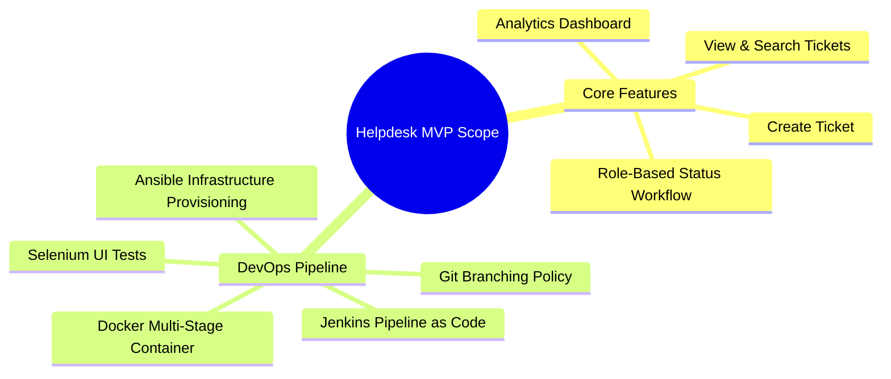

# Module 1 Deliverable: Problem Statement, Stakeholder Analysis, and MVP Scope

**Student Name**: Aditya Singh  
**Roll Number**: `23102B0010`  
**Class/Branch**: CMPN SEM-7 DIV-B  
**Project Title**: Jenkins Deployment for an Employee Helpdesk System  

---

## 1. Executive Summary & Problem Definition

In modern mid-to-large enterprises, IT operations rely heavily on prompt internal support. Traditional ad-hoc ticket reporting methods—such as emails, direct phone calls, or chat messages—suffer from critical operational flaws:
- **Lack of Tracking & Accountability**: IT issues get lost in crowded email inboxes without assigned owners or status visibility.
- **No Prioritization or SLA Management**: Urgent server or network outages are treated with the same urgency as low-priority display requests.
- **Inadequate Reporting**: Management lacks real-time operational metrics regarding resolution times, open ticket backlogs, or agent performance.
- **High MTTR (Mean Time to Resolution)**: Manual hand-offs increase system downtime and reduce employee productivity.

The **Employee Helpdesk System** resolves these pain points by providing a centralized web application for ticket submission, automated status tracking, and IT support agent routing, integrated into a continuous DevOps automation lifecycle.

---

## 2. Stakeholder Analysis

| Stakeholder Role | Needs & Expectations | Impact / Interest |
| :--- | :--- | :--- |
| **End-User (Employee)** | Easy-to-use form to submit IT issues, view status updates, and search resolution steps. | High Impact / High Interest |
| **IT Support Agent** | Clear queue of assigned tickets, priority filters, ability to change ticket status and add resolution notes. | High Impact / High Interest |
| **IT Support Manager** | Real-time analytics dashboard showing ticket breakdown by status, priority, and category. | High Impact / High Interest |
| **DevOps / SysAdmin** | Automated CI/CD pipeline, single-command Docker deployment, zero-downtime rollback capability. | High Impact / High Interest |
| **Course Evaluator / Faculty**| Complete 15-week milestone deliverables, automated Selenium UI testing, Jenkins automation, Ansible IaC scripts. | High Impact / High Interest |

---

## 3. Project Objectives & Measurable Success Criteria

### Objectives
1. **Centralize Incident Management**: Provide a single web dashboard for incident reporting and tracking.
2. **Automate Quality & Deployment**: Eliminate manual server deployment errors by building a Jenkins CI/CD pipeline.
3. **Continuous Testing Gate**: Ensure 100% pass rate on automated Selenium WebDriver UI tests before production deployment.
4. **Infrastructure as Code**: Provision target server dependencies (Java, Docker, Nginx) idempotently using Ansible playbooks.

### Measurable Success Criteria
- **Pipeline Execution Time**: Complete end-to-end Jenkins build, test, and Docker container deployment in **< 3 minutes**.
- **Test Coverage**: 100% pass rate on 4 core user journeys tested via Selenium.
- **System Availability**: Health check endpoint `/actuator/health` responding with HTTP 200 `UP`.
- **Idempotency**: Ansible playbook re-execution completes with zero unexpected changes (`changed=0`).

---

## 4. Operational & Technical Constraints

1. **Deployment Footprint**: Must run efficiently within lightweight Docker containers on standard workstation hardware.
2. **Persistence**: Utilize H2 database for zero-setup execution while supporting SQL/JPA standards.
3. **Security Gate**: Restrict port access; execute container processes without root privileges.
4. **Build Tool Compatibility**: Built using Maven (`mvn clean package`) for seamless Jenkins plugin execution.

---

## 5. Approved 15-Week MVP Scope

The Minimum Viable Product (MVP) scope is frozen as follows:

- **In-Scope**:
  - Ticket submission form (Title, Description, Category, Priority, Requester Name, Email, Department).
  - Ticket directory with real-time text search and status/priority filters.
  - Role-based status workflow (`OPEN` $\rightarrow$ `IN_PROGRESS` $\rightarrow$ `RESOLVED` $\rightarrow$ `CLOSED`).
  - Analytics dashboard with live KPI counters (Total, Open, In-Progress, Resolved, Urgent).
  - Declarative `Jenkinsfile` for CI/CD automation.
  - Selenium WebDriver test suite with automated failure screenshot capturing.
  - Multi-stage `Dockerfile` and `docker-compose.yml`.
  - Ansible playbook (`playbook.yml`) and automated health check/rollback script.
- **Out-of-Scope (Future Enhancements)**:
  - Multi-tenant enterprise SSO (OAuth2 / SAML).
  - SMS notification gateway integration.
