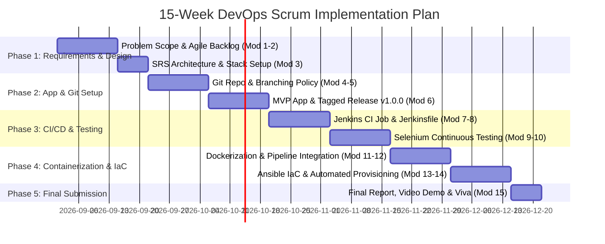

# Module 2 Deliverable: Agile Planning, User Stories, Product Backlog, and DevOps Workflow

**Student Name**: Aditya Singh  
**Roll Number**: `23102B0010`  
**Class/Branch**: CMPN SEM-7 DIV-B  
**Project Title**: Jenkins Deployment for an Employee Helpdesk System  

---

## 1. User Stories & Acceptance Criteria

### User Story 1: Submit an IT Support Ticket
- **As an** Employee,  
- **I want to** submit a new IT issue ticket with details like title, description, category, and priority,  
- **So that** the IT support team can investigate and fix my problem promptly.
- **Acceptance Criteria**:
  - [x] Form fields include Requester Name, Email, Department, Category, Priority, Subject, and Description.
  - [x] Unique Ticket ID (e.g., `TICK-1001`) is generated automatically upon submission.
  - [x] Success message is displayed upon submission.

### User Story 2: Track & Filter Tickets
- **As an** IT Support Agent / Employee,  
- **I want to** search and filter tickets by Status or Priority,  
- **So that** I can easily locate specific requests without manual scrolling.
- **Acceptance Criteria**:
  - [x] Instant text search works on ticket title, ID, requester, or description.
  - [x] Dropdown filters allow filtering by Status (`OPEN`, `IN_PROGRESS`, `RESOLVED`, `CLOSED`) and Priority (`LOW`, `MEDIUM`, `HIGH`, `URGENT`).

### User Story 3: Role-Based Status Workflow
- **As an** IT Support Agent,  
- **I want to** update ticket status, assign an agent, and add resolution notes,  
- **So that** ticket lifecycle progress is communicated to the user.
- **Acceptance Criteria**:
  - [x] Status transition controls allow moving tickets from `OPEN` $\rightarrow$ `IN_PROGRESS` $\rightarrow$ `RESOLVED`.
  - [x] Resolution notes field is saved upon marking ticket as `RESOLVED`.

### User Story 4: Continuous Integration & Automated Testing Gate
- **As a** DevOps Engineer,  
- **I want to** run automated Selenium tests inside Jenkins on every Git push,  
- **So that** broken code is blocked before reaching production servers.
- **Acceptance Criteria**:
  - [x] `Jenkinsfile` runs `mvn test` automatically.
  - [x] Failing Selenium tests abort the pipeline and prevent Docker container deployment.

---

## 2. Product Backlog & 15-Week Kanban/Scrum Timeline

---

## 3. Definition of Done (DoD)

A feature or pipeline stage is considered **Done** only when it satisfies the following criteria:
1. **Clean Code**: Code compiles without errors (`mvn clean package`).
2. **Automated Test Coverage**: Unit tests and Selenium WebDriver tests execute with 100% pass rate.
3. **Containerized**: Multi-stage Dockerfile successfully builds `helpdesk-app:v1.0.0`.
4. **Idempotent Deployment**: Ansible playbook provisions the target node cleanly without errors.
5. **Documentation**: Corresponding Markdown deliverable in `docs/` is updated and committed to Git.

---

## 4. DevOps Lifecycle Diagram

```mermaid
flowchart LR
    subgraph Plan_and_Code [1. Plan & Code]
        A[Git Commit] --> B[GitHub Repository]
    end

    subgraph Continuous_Integration [2. Continuous Integration]
        B -->|SCM Poll / Webhook| C[Jenkins CI Server]
        C --> D[Maven Build & Package]
        D --> E[Selenium Quality Gate]
    end

    subgraph Continuous_Delivery [3. Continuous Delivery]
        E -->|Tests Passed| F[Build Docker Image]
        F --> G[Push to Docker Registry]
    end

    subgraph Continuous_Deployment [4. Continuous Deployment & Ops]
        G --> H[Ansible Target Provisioning]
        H --> I[Deploy Container :8082]
        I --> J[Health Check / Actuator]
        J -->|Healthy| K[Production Live]
        J -->|Failed| L[Automated Rollback]
    end
```

