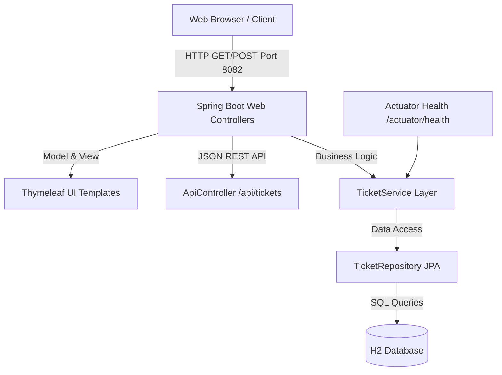
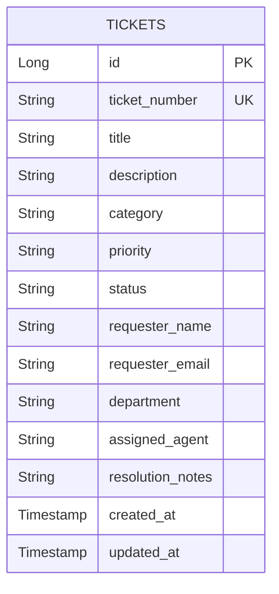

# Module 3 Deliverable: Software Requirements Specification (SRS), Architecture, and Data Model

**Student Name**: Aditya Singh  
**Roll Number**: `23102B0010`  
**Class/Branch**: CMPN SEM-7 DIV-B  
**Project Title**: Jenkins Deployment for an Employee Helpdesk System  

---

## 1. System Architecture Overview

The **Employee Helpdesk System** follows a modern, decoupled 3-tier architecture:
1. **Presentation Tier**: Server-side rendered HTML5 views powered by Spring Boot Thymeleaf and custom Vanilla CSS design system (glassmorphism UI, stat counters).
2. **Application Tier**: Java 17 + Spring Boot 3 web application layer providing REST controllers, service layer business logic, and Actuator health endpoints.
3. **Data Tier**: Spring Data JPA abstraction layered on an H2 database (in-memory with file backup capability) supporting SQL operations.



---

## 2. Use-Case Diagram

```mermaid
usecaseDiagram
    actor Employee as "Employee"
    actor Agent as "IT Support Agent"
    actor DevOps as "Jenkins / CI Automation"

    usecase UC1 as "Submit IT Support Ticket"
    usecase UC2 as "Search & Filter Tickets"
    usecase UC3 as "View Ticket Details"
    usecase UC4 as "Update Status & Add Resolution"
    usecase UC5 as "View Analytics Dashboard"
    usecase UC6 as "Run Automated Health Check"

    Employee --> UC1
    Employee --> UC2
    Employee --> UC3

    Agent --> UC2
    Agent --> UC3
    Agent --> UC4
    Agent --> UC5

    DevOps --> UC6
```

---

## 3. Data Model (Entity-Relationship Diagram)

The core database entity is the `Ticket` table:



---

## 4. REST API Endpoint Specifications

| Endpoint Method | URL Path | Description | Sample Response Code |
| :--- | :--- | :--- | :--- |
| `GET` | `/api/tickets` | Retrieve all tickets as JSON array. | `200 OK` |
| `GET` | `/api/tickets/{id}` | Retrieve single ticket by ID. | `200 OK` / `404 Not Found` |
| `POST` | `/api/tickets` | Create a new ticket (JSON body). | `201 Created` |
| `PATCH` | `/api/tickets/{id}/status` | Update ticket status and agent notes. | `200 OK` |
| `GET` | `/api/tickets/metrics` | Retrieve live dashboard statistics counters. | `200 OK` |
| `GET` | `/actuator/health` | System health check status. | `200 OK {"status":"UP"}` |

---

## 5. Working Local Setup Instructions

### System Requirements
- Java JDK 17
- PowerShell or Command Prompt

### Step-by-Step Instructions
1. Open PowerShell in `c:\Users\Aditya\OneDrive\Desktop\Devops-Project`.
2. Launch application:
   ```powershell
   .\mvnw spring-boot:run
   ```
3. Open browser at `http://localhost:8082/dashboard`.
