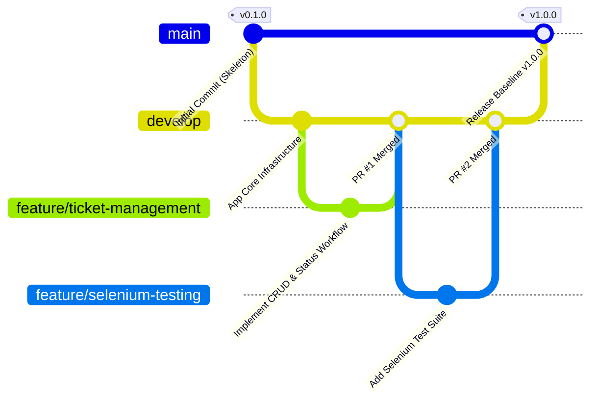

# Module 4 & 6 Deliverable: Git Repository Initialization, Branching Policy, and Release Baseline

**Student Name**: Aditya Singh (Roll No: `23102B0010`)  
**Project Title**: Jenkins Deployment for an Employee Helpdesk System  
**Target Repository URL**: [https://github.com/AdiSinghCodes/Jenkins.git](https://github.com/AdiSinghCodes/Jenkins.git)

---

## 1. Repository Governance & Architecture

The **Employee Helpdesk System** repository is configured with strict software engineering standards to facilitate automated Continuous Integration (CI) and Continuous Deployment (CD).

### Folder Structure Overview
```text
Devops-Project/
├── .github/                       # GitHub issue & PR templates
│   ├── ISSUE_TEMPLATE/
│   │   ├── bug_report.md
│   │   └── feature_request.md
│   └── PULL_REQUEST_TEMPLATE.md
├── docs/                          # Project milestone deliverables & architecture docs
├── devops/                        # Infrastructure & CI/CD pipeline scripts
│   ├── jenkins/                   # Jenkinsfile & job configurations
│   ├── docker/                    # Dockerfile & compose manifests
│   └── ansible/                   # Ansible inventory & playbooks
├── src/
│   ├── main/                      # Spring Boot Java application & Thymeleaf UI
│   └── test/                      # Selenium WebDriver UI test suite
├── pom.xml                        # Maven dependencies & build plugins
├── README.md                      # Primary project documentation
└── .gitignore                     # Exclusion rules for build artifacts & temp files
```

---

## 2. Git Branching Model & Policy

We adopt a structured **Gitflow** branching strategy:



### Branch Naming Rules
1. **`main`**: Protected production branch. Code in `main` must pass all Jenkins CI quality gates and Selenium UI tests.
2. **`develop`**: Primary integration branch where completed features are merged prior to release.
3. **`feature/<feature-name>`**: Short-lived feature branches (e.g., `feature/create-ticket`, `feature/docker-pipeline`).
4. **`bugfix/<bug-name>`**: Fix branches targeted at non-production bugs.
5. **`hotfix/<issue-name>`**: Emergency fixes applied directly to `main` and back-ported to `develop`.

---

## 3. Commit Message Conventions

All commits follow the **Conventional Commits 1.0.0** specification:

| Prefix | Category | Example |
| :--- | :--- | :--- |
| `feat:` | New feature | `feat(ticket): add role-based status workflow` |
| `fix:` | Bug fix | `fix(server): resolve port binding collision on 8080` |
| `docs:` | Documentation | `docs(git): add branching policy deliverable` |
| `test:` | Selenium/Unit tests | `test(selenium): add user journey automated tests` |
| `ci:` | Pipeline updates | `ci(jenkins): configure Maven & Docker stages` |
| `refactor:`| Code refactoring | `refactor(ui): update glassmorphic dashboard styling` |

---

## 4. Pull Request (PR) & Code Review Guidelines

To merge a feature branch into `develop` or `main`:
1. **Branch Up-to-Date**: Ensure branch is rebased onto `develop`.
2. **Pull Request Template**: Complete all sections of `.github/PULL_REQUEST_TEMPLATE.md`.
3. **Automated Verification**: Build (`.\mvnw clean package`) and tests must pass cleanly.
4. **Code Review**: Requires at least 1 peer approval and zero unaddressed comments.

---

## 5. Release Tagging & Source Baseline

Upon completing MVP requirements:
- Create annotated release tag: `git tag -a v1.0.0 -m "Release v1.0.0: Employee Helpdesk System MVP Baseline"`
- Push tag to remote: `git push origin v1.0.0`
