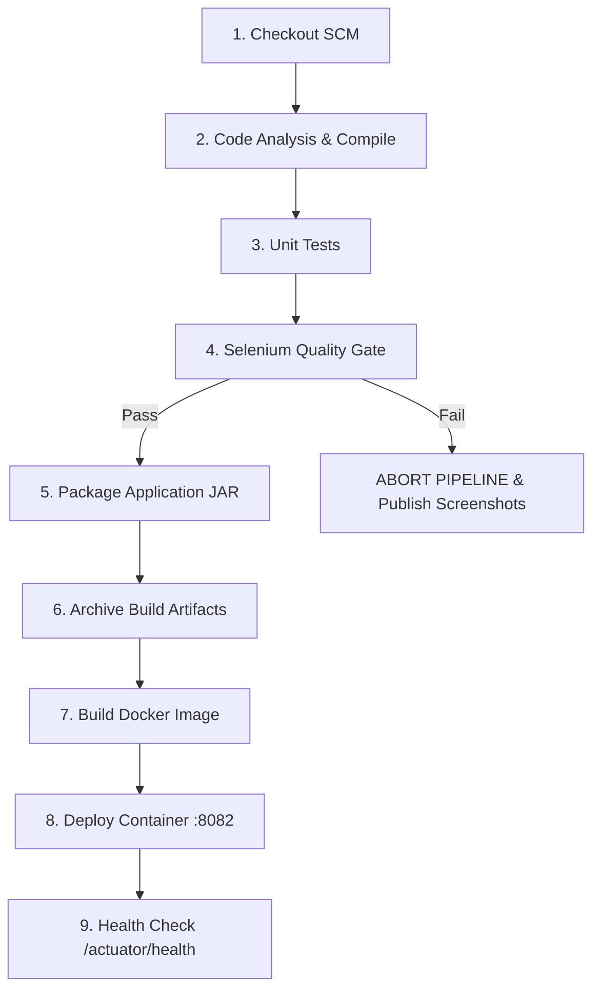

# Modules 7, 8 & 10 Deliverable: Jenkins Installation, Pipeline as Code, and Continuous Testing Gate

**Student Name**: Aditya Singh  
**Roll Number**: `23102B0010`  
**Class/Branch**: CMPN SEM-7 DIV-B  
**Project Title**: Jenkins Deployment for an Employee Helpdesk System  
**Repository URL**: [https://github.com/AdiSinghCodes/Jenkins.git](https://github.com/AdiSinghCodes/Jenkins.git)

---

## 1. Module 7: Jenkins Installation & Job Setup

### Installation Architecture
- **Jenkins Controller**: Installed locally or containerized on port `8080` / `8081`.
- **Global Tools Configured**:
  - JDK 17 (`JDK-17`)
  - Maven 3.9.6 (`Maven-3.9.6`)
  - Git SCM Plugin
- **Trigger Strategy**: Configured with GitHub Webhook (`/github-webhook/`) and SCM Polling (`H/15 * * * *` every 15 minutes).

### Job Configuration File
Sample XML configuration for importing into Jenkins:  
[`devops/jenkins/jenkins_job_config.xml`](file:///c:/Users/Aditya/OneDrive/Desktop/Devops-Project/devops/jenkins/jenkins_job_config.xml)

---

## 2. Module 8: Pipeline as Code (`Jenkinsfile`)

The CI/CD pipeline is defined entirely as code inside [`Jenkinsfile`](file:///c:/Users/Aditya/OneDrive/Desktop/Devops-Project/Jenkinsfile) in the root directory:



### Key Stages Explained
1. **Checkout SCM**: Downloads source code from `https://github.com/AdiSinghCodes/Jenkins.git` (main branch).
2. **Compile & Unit Tests**: Executes `./mvnw clean test -Dtest=*UnitTest*` to ensure unit logic integrity.
3. **Selenium Quality Gate**: Runs headless Selenium WebDriver tests (`./mvnw test -Dtest=EmployeeHelpdeskUserJourneysTest`). Publishes JUnit test results to Jenkins UI.
4. **Archive Build Artifacts**: Stores `target/employee-helpdesk-system-1.0.0.jar` as a permanent build artifact.
5. **Docker Packaging & Rollout**: Builds image `adisingh/employee-helpdesk-system:v1.0.${BUILD_NUMBER}` and deploys container to port `8082`.
6. **Actuator Health Check**: Queries `http://localhost:8082/actuator/health` to confirm deployment health.

---

## 3. Module 10: Continuous Testing Quality Gate & Defect Recovery

### Test Failure Blocking Proof
If a defect is introduced (e.g., breaking the Create Ticket button ID or form submission), the **Selenium Quality Gate** stage catches the failure:

```text
[ERROR] Failures: 
[ERROR]   EmployeeHelpdeskUserJourneysTest.testCreateTicketUserJourney:78 Expected alert to contain 'created successfully' but was not found.
[INFO] 
[INFO] RESULTS: FAILURE
[INFO] ------------------------------------------------------------------------
[INFO] BUILD FAILURE
```

When this occurs:
1. Jenkins immediately **aborts execution** before Stage 5 (Packaging) or Stage 8 (Deployment), protecting production from broken builds.
2. `FailureScreenshotListener` saves a PNG failure screenshot to `target/screenshots/`.
3. Jenkins archives the screenshot artifact for developer debugging.

### Defect Correction & Rerun Workflow
1. Developer inspects failure screenshot in Jenkins UI.
2. Fixes defect on feature branch (e.g., restoring proper button ID `submitTicketBtn`).
3. Commits fix: `fix(ui): restore submit button ID for Selenium selector`.
4. Pushes to GitHub $\rightarrow$ Jenkins pipeline triggers $\rightarrow$ **100% Pass Rate** $\rightarrow$ Deployment proceeds automatically.
