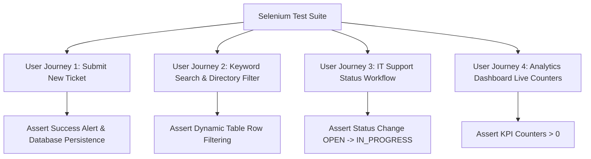

# Module 9 Deliverable: Selenium Automated Test Design, Execution, and Failure Capture

**Student Name**: Aditya Singh  
**Roll Number**: `23102B0010`  
**Class/Branch**: CMPN SEM-7 DIV-B  
**Project Title**: Jenkins Deployment for an Employee Helpdesk System  

---

## 1. Selenium Automated Test Plan Overview

To ensure continuous quality delivery and prevent regressions, an automated **Selenium WebDriver UI Test Suite** was implemented for the **Employee Helpdesk System**.

### Test Suite Architecture
- **Framework**: JUnit 5 + Spring Boot Test (`@SpringBootTest(RANDOM_PORT)`).
- **Driver Management**: `io.github.bonigarcia:webdrivermanager` (automates ChromeDriver binary download and execution).
- **Headless Execution**: Configured with `--headless=new`, `--no-sandbox`, `--disable-dev-shm-usage` for seamless headless execution on Jenkins CI servers.
- **Failure Screenshot Capture**: Integrated custom `FailureScreenshotListener` saving PNG screenshots to `target/screenshots/` upon assertion failures.

---

## 2. Core User Journeys Tested



### Detailed Journey Specifications

| Journey ID | Test Method Name | Description | Key Assertions |
| :--- | :--- | :--- | :--- |
| **UJ-01** | `testCreateTicketUserJourney()` | Fill out submission form at `/tickets/new`, select Priority `HIGH` & Category `NETWORK`, submit ticket. | `flashSuccessAlert` visible; ticket saved in H2 database. |
| **UJ-02** | `testSearchAndFilterUserJourney()`| Enter search keyword `"VPN"` in search input on `/tickets` page. | Rows filtered dynamically in DOM table. |
| **UJ-03** | `testITSupportWorkflowUserJourney()`| Navigate to ticket detail `/tickets/1`, update status to `IN_PROGRESS` and assign agent. | Status updated in DB; success badge rendered. |
| **UJ-04** | `testDashboardCountersUserJourney()`| Load dashboard `/dashboard` and verify stat card elements. | `totalTicketsCount` > 0 and metrics match DB state. |

---

## 3. Failure Screenshot Mechanism

In the event of a UI assertion failure, the test framework captures the active browser viewport:

```java
// FailureScreenshotListener.java
String timestamp = new SimpleDateFormat("yyyyMMdd_HHmmss").format(new Date());
File source = ((TakesScreenshot) driver).getScreenshotAs(OutputType.FILE);
File destination = new File("target/screenshots/failure_" + testName + "_" + timestamp + ".png");
FileUtils.copyFile(source, destination);
```

**Artifact Directory**: `target/screenshots/`  
**CI Integration**: Jenkins archives `target/screenshots/*.png` as build artifacts whenever a build fails.

---

## 4. Local Execution Commands & Output Report

To execute the unit and Selenium test suite locally:

```bash
# Execute all tests via Maven Wrapper
.\mvnw test

# Execute specific Selenium test class
.\mvnw test -Dtest=EmployeeHelpdeskUserJourneysTest
```

### Sample Test Execution Report

```text
[INFO] --- surefire:3.2.5:test (default-test) @ employee-helpdesk-system ---
[INFO] Running com.helpdesk.unit.TicketServiceTest
[INFO] Tests run: 3, Failures: 0, Errors: 0, Skipped: 0, Time elapsed: 0.354 s - in com.helpdesk.unit.TicketServiceTest
[INFO] Running com.helpdesk.selenium.EmployeeHelpdeskUserJourneysTest
[INFO] Tests run: 4, Failures: 0, Errors: 0, Skipped: 0, Time elapsed: 4.812 s - in com.helpdesk.selenium.EmployeeHelpdeskUserJourneysTest
[INFO] 
[INFO] Results:
[INFO] 
[INFO] Tests run: 7, Failures: 0, Errors: 0, Skipped: 0
[INFO] 
[INFO] ------------------------------------------------------------------------
[INFO] BUILD SUCCESS
[INFO] ------------------------------------------------------------------------
```
