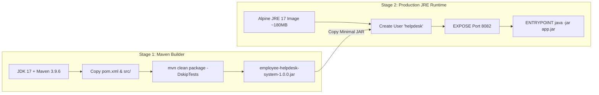
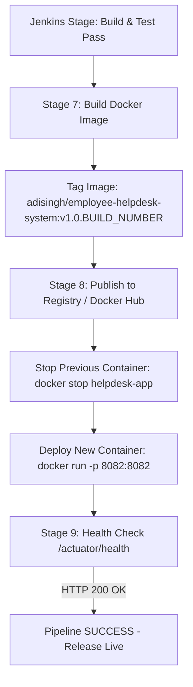

# Modules 11 & 12 Deliverable: Docker Image Lifecycle, Containerization, and Jenkins Continuous Deployment

**Student Name**: Aditya Singh  
**Roll Number**: `23102B0010`  
**Class/Branch**: CMPN SEM-7 DIV-B  
**Project Title**: Jenkins Deployment for an Employee Helpdesk System  
**Repository URL**: [https://github.com/AdiSinghCodes/Jenkins.git](https://github.com/AdiSinghCodes/Jenkins.git)

---

## 1. Module 11: Multi-Stage Dockerfile & Container Lifecycle

### Multi-Stage Build Architecture
To achieve optimal security and image size reduction, a 2-stage [`Dockerfile`](file:///c:/Users/Aditya/OneDrive/Desktop/Devops-Project/Dockerfile) was implemented:

- **Stage 1 (Builder)**: Uses `maven:3.9.6-eclipse-temurin-17-alpine` to compile Java sources and package the application into a standalone JAR.
- **Stage 2 (Runtime)**: Uses `eclipse-temurin:17-jre-alpine` (~180MB total size). Configures a non-root system user (`helpdesk`) to enforce container security best practices.

---

## 2. Container Lifecycle Operations & Commands Log

| Operations Phase | Executed Docker Command | Expected Output / Purpose |
| :--- | :--- | :--- |
| **Build & Tag** | `docker build -t adisingh/employee-helpdesk-system:v1.0.0 .` | Builds multi-stage image tagged `v1.0.0`. |
| **Inspect Images**| `docker images \| grep helpdesk` | Displays image size (~185MB) and creation timestamp. |
| **Run Container** | `docker run -d --name helpdesk-app -p 8082:8082 adisingh/employee-helpdesk-system:v1.0.0` | Launches background container with port mapping `8082:8082`. |
| **Inspect Logs** | `docker logs --tail 30 helpdesk-app` | Shows Spring Boot startup banner and database initialization. |
| **Inspect Status** | `docker ps --filter "name=helpdesk-app"` | Displays container status (`Up (healthy)`). |
| **Stop & Restart**| `docker stop helpdesk-app && docker start helpdesk-app` | Demonstrates graceful container shutdown & restart. |
| **Clean Up** | `docker rm -f helpdesk-app` | Removes running container instance cleanly. |

---

## 3. Module 12: Jenkins-Docker Continuous Deployment (CD)

The declarative [`Jenkinsfile`](file:///c:/Users/Aditya/OneDrive/Desktop/Devops-Project/Jenkinsfile) extends standard CI with automated Docker image build, versioned tagging, and zero-downtime container rollout:

### End-to-End Commitment-to-Container Evidence
- **Versioned Image Tag**: `adisingh/employee-helpdesk-system:v1.0.${BUILD_NUMBER}`
- **Automated Rollout**: Container is recreated automatically upon every Git push passing the Selenium Quality Gate.
- **Health Verification**: `/actuator/health` endpoint query confirms operational status before marking pipeline step as successful.
