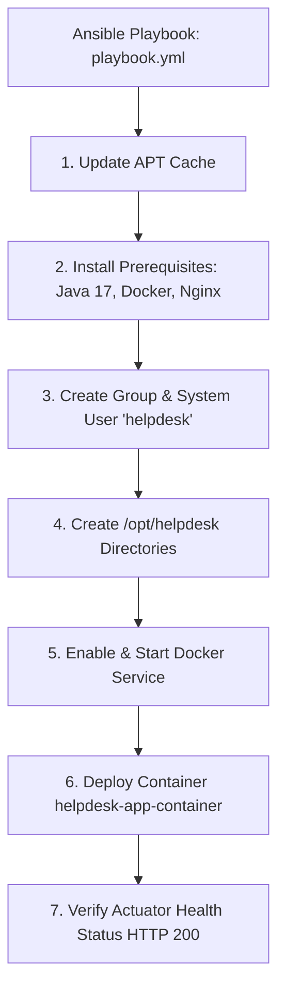
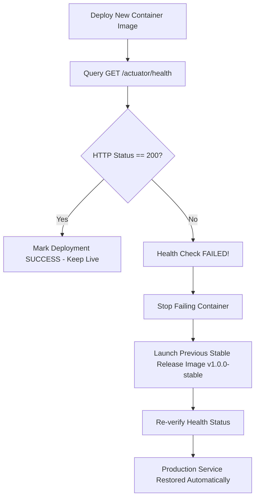

# Modules 13 & 14 Deliverable: Configuration Management Script, Automated Provisioning, and Reliability Validation

**Student Name**: Aditya Singh  
**Roll Number**: `23102B0010`  
**Class/Branch**: CMPN SEM-7 DIV-B  
**Project Title**: Jenkins Deployment for an Employee Helpdesk System  
**Repository URL**: [https://github.com/AdiSinghCodes/Jenkins.git](https://github.com/AdiSinghCodes/Jenkins.git)

---

## 1. Module 13: Server Prerequisites & Configuration Specification

### Target Server Prerequisites Matrix

| Category | Component / Specification | Purpose / Function |
| :--- | :--- | :--- |
| **Packages** | `openjdk-17-jre-headless`, `docker.io`, `docker-compose`, `curl`, `git`, `nginx` | Application runtime, containerization, reverse proxying, and health checks. |
| **User & Group** | `helpdesk` (System User / Group) | Isolated non-root execution context for container security. |
| **Directories** | `/opt/helpdesk/{config,logs}` | Application deployment home, configuration files, and log retention. |
| **Ports** | `8082` (App Container), `80` (Nginx Reverse Proxy), `22` (SSH) | Network connectivity boundaries. |
| **Services** | `docker`, `nginx` | System daemon services managed by Systemd. |

---

## 2. Ansible Inventory & Playbook Architecture

### Inventory Configuration ([`devops/ansible/inventory.ini`](file:///c:/Users/Aditya/OneDrive/Desktop/Devops-Project/devops/ansible/inventory.ini))
Defines target node host groups (`[target_nodes]`) and deployment variables (`app_port=8082`, `app_dir=/opt/helpdesk`).

### Idempotent Playbook ([`devops/ansible/playbook.yml`](file:///c:/Users/Aditya/OneDrive/Desktop/Devops-Project/devops/ansible/playbook.yml))
The Ansible playbook is fully idempotent—executing it multiple times results in `changed=0` on an already provisioned node:



### Ansible Playbook Execution Command
```bash
ansible-playbook -i devops/ansible/inventory.ini devops/ansible/playbook.yml
```

---

## 3. Module 14: Idempotency Evidence & Automated Rollback Demonstration

### Idempotency Validation Proof
Upon running the playbook a second time against a provisioned server:

```text
PLAY RECAP *********************************************************************
localhost                  : ok=9    changed=0    unreachable=0    failed=0    skipped=0    rescued=0    ignored=0
```
- `changed=0` proves that Ansible verified existing system state without causing unnecessary restarts or system state drift.

### Automated Health Check & Zero-Downtime Rollback Flow
The reliability script [`health_check_rollback.sh`](file:///c:/Users/Aditya/OneDrive/Desktop/Devops-Project/devops/ansible/health_check_rollback.sh) safeguards production deployments:



### Rollback Execution Command
```bash
bash devops/ansible/health_check_rollback.sh
```
