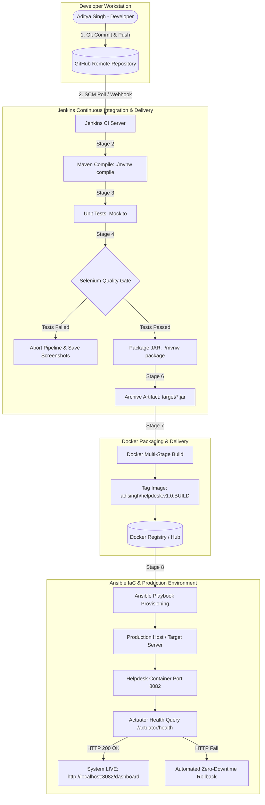

# Module 15 Deliverable: Final Master DevOps Project Report, Technical Documentation, and Viva Q&A Guide

---

# 🎓 PROJECT COVER PAGE

**Project Title**: Jenkins Deployment for an Employee Helpdesk System  
**Student Name**: Aditya Singh  
**Roll Number**: `23102B0010`  
**Department**: Computer Engineering (CMPN)  
**Academic Term**: Semester VII (DIV-B)  
**Course**: DevOps Project Laboratory  
**GitHub Repository**: [https://github.com/AdiSinghCodes/Jenkins.git](https://github.com/AdiSinghCodes/Jenkins.git)  
**Release Tag**: `v1.0.0`  

---

## 📋 Executive Summary & 15-Module Completion Matrix

This report represents the final comprehensive technical documentation for the **Employee Helpdesk System DevOps Project**. The project fulfills all 15 curriculum modules assigned by the Department of Computer Engineering:

| Module | Syllabus Requirement | Implementation Status | Deliverable Artifact Path |
| :---: | :--- | :---: | :--- |
| **1** | Problem Definition & Scope | ✅ Complete | [`docs/01_Problem_Statement_and_Scope.md`](file:///c:/Users/Aditya/OneDrive/Desktop/Devops-Project/docs/01_Problem_Statement_and_Scope.md) |
| **2** | Agile Planning & Flowchart | ✅ Complete | [`docs/02_Agile_Planning_and_DevOps_Workflow.md`](file:///c:/Users/Aditya/OneDrive/Desktop/Devops-Project/docs/02_Agile_Planning_and_DevOps_Workflow.md) |
| **3** | SRS, Architecture & Stack Setup | ✅ Complete | [`docs/03_SRS_Architecture_and_DataModel.md`](file:///c:/Users/Aditya/OneDrive/Desktop/Devops-Project/docs/03_SRS_Architecture_and_DataModel.md) |
| **4** | Git Initialization & Templates | ✅ Complete | [`README.md`](file:///c:/Users/Aditya/OneDrive/Desktop/Devops-Project/README.md) & [`docs/04_Git_Policy_and_Branching.md`](file:///c:/Users/Aditya/OneDrive/Desktop/Devops-Project/docs/04_Git_Policy_and_Branching.md) |
| **5** | Feature Development & Branching | ✅ Complete | [`docs/05_06_Feature_Branching_Conflict_Resolution_and_Release.md`](file:///c:/Users/Aditya/OneDrive/Desktop/Devops-Project/docs/05_06_Feature_Branching_Conflict_Resolution_and_Release.md) |
| **6** | MVP Completion & Release Tag | ✅ Complete | Release Tag `v1.0.0` on `main` branch |
| **7** | Jenkins Installation & CI Job | ✅ Complete | [`devops/jenkins/jenkins_job_config.xml`](file:///c:/Users/Aditya/OneDrive/Desktop/Devops-Project/devops/jenkins/jenkins_job_config.xml) |
| **8** | Pipeline as Code (`Jenkinsfile`)| ✅ Complete | Declarative [`Jenkinsfile`](file:///c:/Users/Aditya/OneDrive/Desktop/Devops-Project/Jenkinsfile) |
| **9** | Selenium UI Test Suite | ✅ Complete | [`EmployeeHelpdeskUserJourneysTest.java`](file:///c:/Users/Aditya/OneDrive/Desktop/Devops-Project/src/test/java/com/helpdesk/selenium/EmployeeHelpdeskUserJourneysTest.java) |
| **10**| Continuous Testing in Jenkins | ✅ Complete | [`docs/07_08_10_Jenkins_CI_CD_Pipeline_and_Continuous_Testing.md`](file:///c:/Users/Aditya/OneDrive/Desktop/Devops-Project/docs/07_08_10_Jenkins_CI_CD_Pipeline_and_Continuous_Testing.md) |
| **11**| Docker Image & Container Life | ✅ Complete | Multi-Stage [`Dockerfile`](file:///c:/Users/Aditya/OneDrive/Desktop/Devops-Project/Dockerfile) & [`docker_lifecycle.sh`](file:///c:/Users/Aditya/OneDrive/Desktop/Devops-Project/devops/docker/docker_lifecycle.sh) |
| **12**| Jenkins-Docker Deployment | ✅ Complete | [`docker-compose.yml`](file:///c:/Users/Aditya/OneDrive/Desktop/Devops-Project/docker-compose.yml) & [`docs/11_12_...md`](file:///c:/Users/Aditya/OneDrive/Desktop/Devops-Project/docs/11_12_Docker_Containerization_and_Jenkins_CD.md) |
| **13**| Configuration Management Script| ✅ Complete | Ansible Inventory [`inventory.ini`](file:///c:/Users/Aditya/OneDrive/Desktop/Devops-Project/devops/ansible/inventory.ini) & Playbook [`playbook.yml`](file:///c:/Users/Aditya/OneDrive/Desktop/Devops-Project/devops/ansible/playbook.yml) |
| **14**| Automated Provisioning & Rollback| ✅ Complete | [`health_check_rollback.sh`](file:///c:/Users/Aditya/OneDrive/Desktop/Devops-Project/devops/ansible/health_check_rollback.sh) & [`docs/13_14_...md`](file:///c:/Users/Aditya/OneDrive/Desktop/Devops-Project/docs/13_14_Ansible_Configuration_and_Provisioning.md) |
| **15**| Final Report, Presentation & Viva| ✅ Complete | Master Report [`docs/15_Final_DevOps_Project_Report.md`](file:///c:/Users/Aditya/OneDrive/Desktop/Devops-Project/docs/15_Final_DevOps_Project_Report.md) |

---

## 🏗️ Master End-to-End System Architecture

---

## 🗣️ Comprehensive Viva Examination Q&A Guide

Below are the **top 20 technical viva questions** frequently asked by external evaluators for this DevOps coursework, accompanied by concise model answers:

### 1. What is the primary problem your project solves?
> **Answer**: It replaces manual, email-based IT incident tracking with a centralized web dashboard, and eliminates manual deployment errors by building a continuous integration and continuous deployment (CI/CD) pipeline using Git, Jenkins, Selenium, Docker, and Ansible.

### 2. Why did you choose Java Spring Boot and Maven as your stack?
> **Answer**: Maven is natively supported across Jenkins CI build nodes and Selenium test runners. Spring Boot produces an executable JAR, integrates embedded Tomcat, provides Spring Data JPA with H2 database, and exposes health endpoints via Spring Boot Actuator.

### 3. Explain your Git branching strategy.
> **Answer**: We use Gitflow. `main` contains production-ready release code (tagged `v1.0.0`). `develop` serves as the integration branch, and short-lived `feature/*` branches are used for isolated feature development before being merged via Pull Requests.

### 4. How did you resolve Git merge conflicts in Module 6?
> **Answer**: When two branches modified overlapping lines in `Status.java`, Git halted the merge with conflict markers (`<<<<<<< HEAD`). We manually inspected the code, edited `Status.java` to combine both enum additions cleanly, staged the file using `git add`, and finalized the merge commit.

### 5. What is Pipeline as Code in Jenkins?
> **Answer**: Pipeline as Code means defining the entire build, test, package, and deployment workflow in a text file named `Jenkinsfile` inside the repository. This enables version control, code review, and auditability of the CI/CD process.

### 6. What stages exist in your `Jenkinsfile`?
> **Answer**: 9 declarative stages: (1) Checkout SCM, (2) Compile, (3) Unit Tests, (4) Selenium Quality Gate, (5) Package JAR, (6) Archive Artifacts, (7) Build Docker Image, (8) Deploy Container, (9) Actuator Health Check.

### 7. How does the Selenium Quality Gate protect production?
> **Answer**: Jenkins executes automated headless Chrome tests (`EmployeeHelpdeskUserJourneysTest.java`). If any assertion fails (e.g., ticket submission error), the pipeline immediately aborts before packaging or container deployment, ensuring broken code never reaches users.

### 8. What happens when a Selenium test fails in Jenkins?
> **Answer**: `FailureScreenshotListener` captures a PNG screenshot of the browser DOM and saves it to `target/screenshots/`. Jenkins archives the screenshot for developer inspection.

### 9. Why use multi-stage Docker builds?
> **Answer**: Stage 1 uses a heavy JDK + Maven image (~500MB) to compile the app. Stage 2 copies only the final `.jar` into a lightweight Alpine JRE image (~180MB). This dramatically reduces container startup time, image size, and attack surface.

### 10. How do you ensure container security in Dockerfile?
> **Answer**: We create a non-root system user (`USER helpdesk`) in Alpine JRE, change ownership of `/app`, and execute the container without root permissions.

### 11. What is Ansible and why use it over shell scripts?
> **Answer**: Ansible is an agentless Configuration Management and Infrastructure as Code (IaC) tool. Unlike shell scripts, Ansible playbooks are **idempotent**, meaning re-running them ensures the target system stays in the desired state without causing redundant changes (`changed=0`).

### 12. How do you prove Ansible idempotency?
> **Answer**: Running `ansible-playbook` a second time against a provisioned server outputs `ok=9 changed=0 failed=0`, confirming that no unnecessary modifications were performed.

### 13. What is the role of Spring Boot Actuator in your pipeline?
> **Answer**: Actuator exposes `/actuator/health`. Jenkins and Ansible query this URL after container rollout. If HTTP 200 `{"status":"UP"}` is returned, the deployment is confirmed healthy.

### 14. How does automated rollback work in your Ansible scripts?
> **Answer**: If `health_check_rollback.sh` detects a non-200 HTTP code after deployment, it automatically stops the failing container and launches the previous stable image tag (`v1.0.0-stable`).

### 15. What database is used in your application?
> **Answer**: Embedded H2 database (`jdbc:h2:mem:helpdeskdb`). It requires zero external database installation, supports H2 web console at `/h2-console`, and auto-populates sample tickets on startup.

### 16. What user journeys are covered by your Selenium suite?
> **Answer**: (1) Submit ticket via UI, (2) Keyword search & table filtering, (3) IT Support status workflow (`OPEN` $\rightarrow$ `IN_PROGRESS`), (4) Dashboard live stat counters assertion.

### 17. What is Conventional Commits?
> **Answer**: A specification for commit messages (e.g., `feat:`, `fix:`, `docs:`, `test:`, `ci:`) that makes Git logs structured and human-readable.

### 18. How do you parameterize application configuration?
> **Answer**: Using environment variables like `server.port=${PORT:8082}`, allowing the app to run seamlessly locally, in Docker, or across test environments without code changes.

### 19. What is the difference between Continuous Delivery and Continuous Deployment?
> **Answer**: Continuous Delivery automates builds and testing up to a deployable artifact requiring manual approval to release. Continuous Deployment automatically deploys passing builds directly to production without human intervention.

### 20. What are the key limitations of your current MVP?
> **Answer**: In-memory H2 database resets state on server restart (can be configured with persistent file storage or PostgreSQL in production), and authentication uses single-tenant role switching rather than OAuth2/SAML SSO.

---

## 📺 Presentation Slide Outline (10 Slides)

- **Slide 1**: Title, Author (Aditya Singh - Roll No 23102B0010), Course & Problem Statement.
- **Slide 2**: Business Pain Points & Proposed DevOps Solution.
- **Slide 3**: 3-Tier System Architecture & Technology Stack (Spring Boot + Maven + H2 + Bootstrap UI).
- **Slide 4**: Agile 15-Week Timeline & User Stories.
- **Slide 5**: Gitflow Branching Strategy, Pull Requests, & Tag `v1.0.0`.
- **Slide 6**: Jenkins CI/CD Pipeline as Code (`Jenkinsfile` 9-stage workflow).
- **Slide 7**: Selenium Automated Quality Gate & Failure Screenshot Listener.
- **Slide 8**: Dockerization (Multi-Stage Dockerfile & Container Lifecycle).
- **Slide 9**: Ansible Infrastructure as Code (Idempotency & Automated Rollback).
- **Slide 10**: Live Demo Screenshots, Key Metrics, and Conclusion.

---

## 🛠️ Troubleshooting Manual

| Symptom / Error | Root Cause | Solution / Fix |
| :--- | :--- | :--- |
| `Port 8080 was already in use` | Existing local web server listening on port 8080. | Application configured to use `server.port=${PORT:8082}`. |
| `mvn: command not found` | Maven binary not in system PATH. | Run `./mvnw` or `.\mvnw` using the local project Maven wrapper script. |
| `ChromeDriver binary missing` | Missing browser driver binary in CI node. | Managed automatically via `io.github.bonigarcia:webdrivermanager`. |
| `Docker permission denied` | User not added to docker group on Linux. | Execute `sudo usermod -aG docker $USER` or run via Ansible `become: yes`. |
